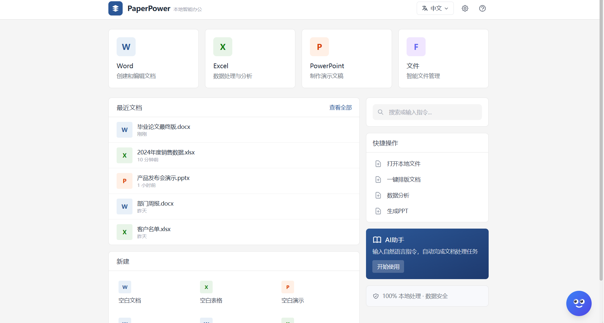
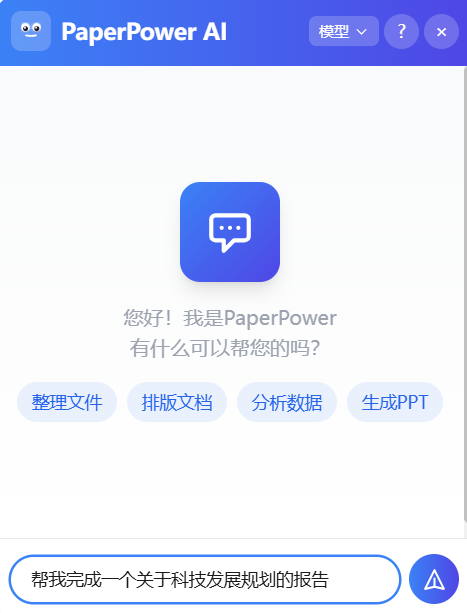
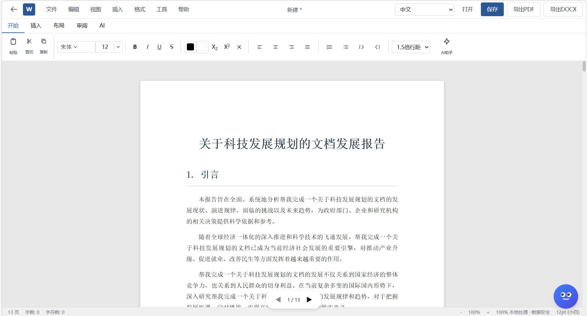

# PaperPower Bilingual AI Office Suite

<div align="center">

**Local-First · AI-Powered · Full-Scenario Office Intelligence**

[简体中文](./README.md) | English

[](https://opensource.org/licenses/MIT)
[](https://www.python.org/downloads/)
[](https://nodejs.org/)
[](https://www.typescriptlang.org/)
[](https://react.dev/)

**Making AI truly understand your office needs — not just chatting, but thinking, deciding, and executing**

</div>

---

## Product Showcase

### PaperPower Home

<div align="center">

</div>

> All-in-one AI office platform: Word generation, Excel analysis, PPT creation, AI chat — all integrated in one interface.

### AI Smart Chat — Four-Personality Decision Engine

<div align="center">


</div>

> **Left**: Send instructions to PaperPower, AI automatically identifies intent and executes tasks
> **Right**: AI selects the optimal personality strategy based on task type and provides professional responses

**Four-Personality Decision Flow**: User Input → 6-D Classification → 4-Personality Scoring → Best Personality → Domain-Specific Response

| Persona | Icon | Trigger Scenario | Behavior |
|---------|------|------------------|----------|
| Executor | ⚡ | "Write a report" "Generate PPT" | Direct action, fast completion |
| Advisor | 🎯 | "I want to make a PPT but don't know how" | Clarify requirements first |
| Creator | 🎨 | "Give me some creative ideas" | Provide multiple options |
| Analyst | 🔬 | "Analyze this data" | Deep analysis before responding |

### Word Intelligent Document Generation

<div align="center">

</div>

> Enter a topic to auto-generate complete documents with: auto images, policy references, 7 document frameworks (report/proposal/thesis/resume/business plan, etc.)

### PPT Creation & Excel Data Analysis

> **PPT** — 27-category semantic image search + smart layout + animation system + multiple templates
> **Excel** — Smart formula generation + data visualization + financial analysis templates + pivot tables
>
> These features are best experienced **firsthand** to truly feel the AI-powered office efficiency boost! 🚀

---

## Why PaperPower?

Most AI office tools are just "wrappers" around LLM APIs. **PaperPower is different**:

- 🧠 **Four-Personality Decision Engine** — AI doesn't just reply; it analyzes tasks through 4 personas, selecting the optimal strategy
- 🌐 **Fully Local Operation** — Core features work without internet, zero data leakage
- 📄 **Complete Office Suite** — Word generation, Excel analysis, PPT creation, semantic image search — all-in-one
- 🔒 **Proprietary BilingualTokenizer** — Optimized Chinese-English understanding, 1.5-2 tokens/char (50%+ savings)
- 🎯 **Quality Gate System** — Multi-layer garbled text detection + quality scoring + automatic degradation fallback

## Architecture

```
┌─────────────────────────────────────────────────────────────┐
│                     Frontend (React + TypeScript)             │
│  ┌──────────┐ ┌──────────┐ ┌──────────┐ ┌─────────────────┐ │
│  │ MiniAI   │ │ DocGen   │ │ DataLab  │ │ ImageFusion     │ │
│  │ AI Chat  │ │ Documents│ │ Analysis │ │ Image Search     │ │
│  └────┬─────┘ └────┬─────┘ └────┬─────┘ └──────┬──────────┘ │
│       └────────────┼────────────┼───────────────┘            │
│                    ▼                                        │
│  ┌───────────────────────────────────────────────────────┐  │
│  │           Core Engine Layer (intelligentDialogue.ts)    │  │
│  │  Intent Detection → Quality Gate → Model Call → 4-Persona Fallback │  │
│  └───────────────────────────────────────────────────────┘  │
└─────────────────────────────────────────────────────────────┘
                              │
                              ▼
┌─────────────────────────────────────────────────────────────┐
│                     Backend (FastAPI + Python)                │
│  ┌──────────────┐ ┌──────────────┐ ┌────────────────────┐   │
│  │ model_server │ │ multi_agent  │ │ image_service      │   │
│  │ Bilingual    │ │ DeerFlow     │ │ 27-Cat Semantic    │   │
│  │ Transformer  │ │ Workflow     │ │ Search             │   │
│  └──────────────┘ └──────────────┘ └────────────────────┘   │
└─────────────────────────────────────────────────────────────┘
```

## Quick Start

### Prerequisites

- **Python** >= 3.10
- **Node.js** >= 18
- **npm** or **pnpm**
- **Docker** (optional, recommended)

### One-Command Start (Docker Recommended)

```bash
git clone https://github.com/YOUR_USERNAME/zhiban-ai.git
cd zhiban-ai
docker-compose up -d

# Access:
# Frontend: http://localhost:5174
# Backend API: http://localhost:8000
# API Docs: http://localhost:8000/docs
```

### Manual Installation

```bash
# 1. Python backend
pip install -r requirements.txt

# 2. Node.js frontend
npm install

# 3. Start model server (Terminal 1)
python model_server.py

# 4. Start API server (Terminal 2)
python -m uvicorn shared.backend.api_server_v2:app --host 0.0.0.0 --port 8000

# 5. Start frontend dev server (Terminal 3)
npm run dev
```

### Environment Setup

```bash
cp .env.example .env.local
# Edit .env.local with your configuration
```

## Core Modules

### Four-Personality Decision Engine (`src/utils/actionDecisionEngine.ts`)

The "brain" of PaperPower. When users send messages:

1. **TaskClassifier** performs 6-D classification (task/question/creative/clarification/urgency/complexity/domain)
2. **ActionDecisionEngine** scores all 4 personalities, selects best match
3. **Personality Respond** generates domain-specific professional response

| Persona | Icon | Best For | Decision Style |
|---------|------|----------|----------------|
| Executor | ⚡ | Clear instructions | Direct action, fast completion |
| Advisor | 🎯 | Unclear requirements | Clarify first, then execute |
| Creator | 🎨 | Open-ended problems | Provide multiple options |
| Analyst | 🔬 | Complex analysis/research | Deep analysis before responding |

### Intelligent Dialogue Engine (`src/utils/intelligentDialogue.ts`)

- **Intent Detection**: 5 intent types (document/data/PPT/image/code/general)
- **Quality Gate**: Multi-source scoring (multiAgent > modelService > localTemplate > actionEngine)
- **Garbled Text Protection**: 5 detection patterns + Tokenizer whitelist + decode validation
- **A/B/C Option Understanding**: Context-aware single-letter response handling
- **Conversation Memory**: 20-message window + recent 6 messages to decision engine

### Semantic Image Search (`src/utils/semanticImageSearch.ts`)

- **27 fine-grained categories** (expanded from 8)
- **200+ domain term vocabulary**
- **20 query enhancement rules**
- **Smart Fallback mechanism** (loremflickr, etc.)

### Intelligent Document Generator (`src/utils/intelligentDocumentGenerator.ts`)

- **7 document frameworks** (report/proposal/thesis/resume/business plan, etc.)
- **27 content expansion patterns**
- **LRU cache** (capacity 50)
- **Markdown export support**

### Proprietary BilingualTokenizer (`model_server.py`)

- **150+ common Chinese character whitelist**
- **Output sanitization** via `_sanitize_output()`
- **Text validity validation** via `is_valid_text()`
- **Decode generated tokens only** (prevents input pollution)

## Tech Stack

| Layer | Technology | Notes |
|-------|------------|-------|
| **Frontend** | React 18 + TypeScript | Type-safe modern UI |
| **UI Library** | MUI v7 | Enterprise design system |
| **State** | Zustand | Lightweight state management |
| **Build** | Vite 5 | Lightning-fast DX |
| **Routing** | React Router v6 | SPA routing |
| **Backend** | FastAPI + Uvicorn | High-performance async API |
| **AI Model** | Custom Bilingual Transformer | Local inference |
| **Office** | mammoth/xlsx/pptxgenjs/pdf-lib | Full format support |
| **OCR** | Tesseract.js | Browser-side OCR |
| **Embeddings** | @xenova/transformers | Browser-side NLP |
| **Container** | Docker + Compose | One-click deploy |

## Project Structure

```
zhiban-ai/
├── src/                          # Frontend source
│   ├── components/               # React components
│   │   ├── MiniAI.tsx           # ⭐ AI Chat main component
│   │   ├── DocumentEditor.tsx   # Document editor
│   │   ├── DataAnalysis.tsx     # Data analysis panel
│   │   ├── PresentationGen.tsx  # PPT generator
│   │   └── ImageFusion.tsx      # Image fusion tool
│   ├── pages/                    # Page components
│   ├── utils/                    # ⭐ Core engines
│   │   ├── intelligentDialogue.ts       # Dialogue engine
│   │   ├── actionDecisionEngine.ts      # 4-Personality decision
│   │   ├── semanticImageSearch.ts       # Semantic image search
│   │   ├── intelligentDocumentGenerator.ts # Document generator
│   │   └── localAI/
│   │       └── ModelService.ts   # Local model service
│   ├── services/                 # API service layer
│   ├── store/                    # Zustand store
│   └── contexts/                 # React Context
├── shared/backend/               # Python backend
│   ├── api_server_v2.py          # FastAPI main server
│   ├── multi_agent/              # Multi-Agent workflow
│   ├── image_service.py          # Image search service
│   └── ...
├── model/                        # AI model architecture
│   ├── bilingual_transformer/    # Bilingual Transformer
│   ├── rope/                     # Rotary Position Encoding
│   └── quantization/             # Quantization modules
├── model_server.py               # ⭐ Model inference server
├── tokenizer/                    # International tokenizer
├── agent/                        # Bilingual Agent
├── scripts/                      # Training/data processing
├── tests/                        # Test suites
├── docs/                         # Documentation
│   ├── architecture.md           # Architecture design
│   ├── api_reference.md          # API reference
│   ├── USAGE_GUIDE.md            # Usage guide
│   └── SELF_TRAINING_PLAN.md     # Self-training plan
├── examples/                     # Usage examples
├── Dockerfile                    # Docker build file
├── docker-compose.yml            # Orchestration config
├── package.json                  # Node.js deps
├── requirements.txt              # Python deps
├── pyproject.toml                # Python project config
├── vite.config.ts                # Vite config
├── tsconfig.json                 # TypeScript config
├── .env.example                  # Environment template
└── LICENSE                       # MIT License
```

## Running Tests

```bash
# Frontend tests
npm test

# With coverage
npm run test:coverage

# Python backend tests
pytest tests/ -v

# TypeScript type check
npm run typecheck

# ESLint linting
npm run lint

# Production build
npm run build
```

## Performance Metrics

| Metric | Value | Notes |
|--------|-------|-------|
| Chinese Token Efficiency | 1.5-2 tok/char | 50%+ better than byte encoding |
| Response Latency | <500ms (local) | Local model inference |
| Garbled Text Detection | 95%+ accuracy | 5 pattern联合检测 |
| Decision Engine Dimensions | 6-D | TaskClassifier |
| Personality Strategies | 4×4=16 | 4 personas × 4 domains |
| Image Search Categories | 27 | Fine-grained semantic |
| Document Templates | 7 | Covers major office scenarios |

## Roadmap

- [x] v0.1 — Basic office suite (Word/Excel/PPT/AI Chat)
- [x] v0.2 — 4-Personality decision engine + Quality gate system
- [x] v0.3 — Garbled text protection + Enhanced semantic image search
- [ ] v0.4 — Multimodal support (voice input/image understanding)
- [ ] v0.5 — Plugin marketplace + Custom Agents
- [ ] v1.0 — Enterprise edition + Collaboration features

## Contributing

We welcome all forms of contribution! Code, docs, bug reports, feature requests.

See [CONTRIBUTING.md](./CONTRIBUTING.md) for detailed guidelines.

### Quick Contribute Flow

1. Fork this repo
2. Create feature branch `git checkout -b feature/amazing-feature`
3. Commit changes `git commit -m 'Add amazing feature'`
4. Push to branch `git push origin feature/amazing-feature`
5. Open Pull Request

## License

This project is licensed under the [MIT License](./LICENSE).

```
Copyright (c) 2025 张稷 (Zhang Ji)

Permission is hereby granted, free of charge, to any person obtaining a copy
of this software and associated documentation files (the "Software"), to deal
in the Software without restriction...
```

## Acknowledgments

### Special Thanks

- **[Trae](https://www.trae.ai/)** — This project was developed with Trae AI assistance. Core architecture and key modules were co-written with Trae, then reviewed and modified by the author. Trae provided tremendous help in code generation, bug fixing, and architecture optimization, significantly boosting development efficiency.

### Technical Thanks

- [React](https://react.dev/) — Frontend framework
- [MUI](https://mui.com/) — UI component library
- [FastAPI](https://fastapi.tiangolo.com/) — Backend framework
- [PyTorch](https://pytorch.org/) — Deep learning framework
- [Vite](https://vitejs.dev/) — Build tool
- [Tesseract.js](https://tesseract.projectnaptha.com/) — OCR recognition
- [@xenova/transformers](https://github.com/xenova/transformers.js) — Browser-side Transformers

## Author

**张稷 (Zhang Ji)** — Independent Developer

📧 Contact: [zhangji200512@outlook.com](mailto:zhangji200512@outlook.com)

If you find this project helpful, please consider giving it a ⭐ Star!

---

<div align="center">

**⭐ Star this repo if you find it useful! ⭐**

Made with ❤️ by 张稷 | Powered by [Trae](https://www.trae.ai/)

</div>
